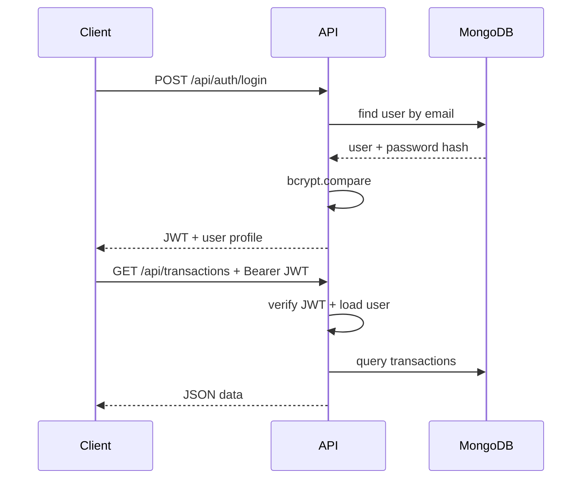

# IT6006 — Enterprise Finance API (Academic Documentation)

## 1. Problem Statement

Small and mid-sized organisations need a **controlled, auditable way** to record financial movements (credits, debits, adjustments) and to expose that data through an API consumed by internal tools or future web clients. The system must ensure that **only authorised staff** can change the ledger, while other stakeholders may have **read-only** visibility. Without strong authentication, authorisation, validation, and transport-level hardening, such an API is vulnerable to **credential theft, privilege abuse, data tampering, and injection attacks** — all unacceptable in a finance context, even for a classroom prototype.

## 2. Solution Statement

This project delivers a **modular Node.js + Express** backend backed by **MongoDB (Mongoose)**. **JWT** carries proof of identity after **bcrypt**-hashed password verification. **Role-based middleware** enforces **ADMIN**, **ACCOUNTANT**, and **USER** capabilities. **express-validator** validates all critical inputs; **helmet**, **rate limiting**, and **mongo sanitization** reduce common web and NoSQL risks. Errors are funnelled through a **central handler** with consistent JSON and appropriate HTTP status codes. A **seeded ADMIN** account enables first-time setup without manual database scripting.

---

## 3. Functional Requirements

| ID | Requirement |
|----|-------------|
| FR-1 | Users can **sign up** (default role USER) and **log in** to receive a JWT. |
| FR-2 | **ADMIN** can list and create users with a chosen role. |
| FR-3 | **ADMIN** and **ACCOUNTANT** can **create** and **update** any transaction; **USER** can **list** and **create** own transactions and **update** **own** rows only. |
| FR-4 | **ADMIN** can **delete** transactions. |
| FR-5 | **ADMIN** and **ACCOUNTANT** can create **credit** and **debit** notes via dedicated endpoints. |
| FR-6 | Transactions include **amount (> 0)**, **type** (credit/debit), **description**, **date**, and **creator reference**. |
| FR-7 | API returns **structured JSON** for success and failure. |

---

## 4. Non-Functional Requirements

| ID | Requirement |
|----|-------------|
| NFR-1 | **Security**: passwords stored hashed; JWT expiry; RBAC; input validation and sanitization. |
| NFR-2 | **Maintainability**: layered structure (routes → controllers → models → middleware). |
| NFR-3 | **Reliability**: explicit DB connection failure handling; configuration via environment variables. |
| NFR-4 | **Observability (academic)**: health endpoint; consistent error codes in JSON. |
| NFR-5 | **Operational hygiene**: `.env.example` documents required secrets without committing real values. |

---

## 5. Security & Privacy Policies (Summary)

### 5.1 Password hashing

Plain-text passwords are **never** stored. **bcrypt** applies an adaptive work factor (salt rounds) so offline cracking of a leaked database is expensive. The password field is excluded from default queries (`select: false`) to reduce accidental exposure in API responses.

### 5.2 JWT authentication

After successful login, the server issues a **signed JWT** containing the user id and role. The client sends `Authorization: Bearer <token>`. The server verifies the **signature** and **expiry** on each protected request. Tokens are **short-lived** (configurable via `JWT_EXPIRES_IN`) to limit the window of abuse if stolen.

### 5.3 Role-based access control (RBAC)

**ADMIN**: full access including user administration and transaction deletion.  
**ACCOUNTANT**: create/update transactions and issue notes (no delete).  
**USER**: listing scoped to **own** transactions; may **create** and **update** own rows; cannot **delete** or access staff-only features (e.g. notes, user admin).

### 5.4 Input validation

**express-validator** enforces email format, password length, positive amounts, enums, and MongoDB id formats. Invalid input yields **422** with field-level messages suitable for UI display or grading.

### 5.5 Secure API practices

- **helmet** sets security-related HTTP headers.  
- **Rate limiting** reduces brute-force and volumetric abuse (stricter on `/api/auth`).  
- **express-mongo-sanitize** mitigates **NoSQL injection** via operator keys in payloads.  
- **JSON body size limit** reduces denial-of-service via huge payloads.  
- **Generic login failure message** avoids **account enumeration**.  
- **Secrets and connection strings** live in **`.env`**, not in source control.

---

## 6. System Design

### 6.1 Authentication design

1. Client posts credentials to `POST /api/auth/login`.  
2. Server loads user (including password hash), compares with **bcrypt.compare**.  
3. On success, server signs JWT with **HMAC** using `JWT_SECRET`.  
4. Client attaches JWT to subsequent requests.  
5. **authenticate** middleware verifies JWT and loads current user from DB (so revoked/deleted users lose access even if a token still parses).

### 6.2 Authorisation design

Authentication establishes **who** the caller is. Authorisation decides **what** they may do. After `authenticate`, route-specific **`allowRoles(...)`** middleware checks `req.user.role` against allowed roles. This keeps policy **declarative** at the route layer and prevents duplicated checks inside every controller.

### 6.3 URL design (RESTful + secure)

| Method | Path | Purpose | Auth / Role |
|--------|------|---------|-------------|
| POST | `/api/auth/signup` | Register | Public |
| POST | `/api/auth/login` | Login | Public |
| GET | `/api/users` | List users | ADMIN |
| POST | `/api/users` | Create user | ADMIN |
| GET | `/api/transactions` | List transactions | JWT (USER: own rows only) |
| POST | `/api/transactions` | Create | ADMIN, ACCOUNTANT, USER |
| PUT | `/api/transactions/:id` | Update | ADMIN, ACCOUNTANT; USER (**own** row only) |
| DELETE | `/api/transactions/:id` | Delete | ADMIN |
| POST | `/api/notes/credit` | Credit note | ADMIN, ACCOUNTANT |
| POST | `/api/notes/debit` | Debit note | ADMIN, ACCOUNTANT |
| GET | `/api/health` | Liveness | Public |

Resources are **noun-based**; actions use **HTTP verbs**. Sensitive operations (delete, user admin) are **narrowly scoped** to ADMIN.

---

## 7. Setup (Minimal)

1. Install [MongoDB](https://www.mongodb.com/) locally or use Atlas.  
2. `cd backend && npm install`  
3. Copy `.env.example` to `.env` and set `MONGODB_URI`, `JWT_SECRET` (≥32 chars), and optional seed admin values.  
4. `npm start` — API listens on `PORT` (default 5000).  
5. Import `postman/IT6006_Enterprise_Finance.postman_collection.json` for sample requests.

---

*End of academic documentation.*
