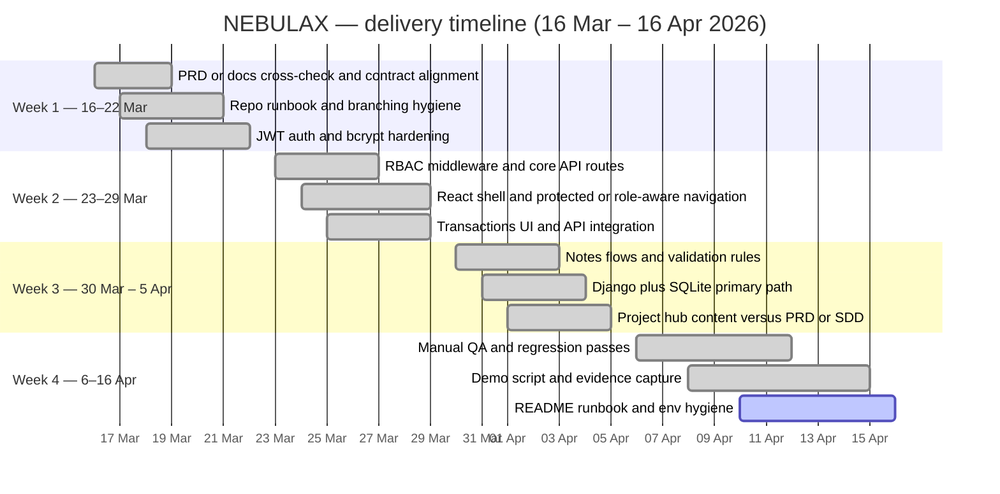

# IT6006 — NEBULAX · Project Kanban

**Purpose:** A Kanban-style view of how work moved through the project, with **completion dates** covering the **last month through today** (coursework evidence and team narrative). Align any date with your real commits, meetings, and submission deadline if needed.

**Team:** NEBULAX · **Module:** IT6006 — Secure Finance Management Web Application  

**Reporting window:** **16 March 2026 → 16 April 2026** (inclusive).

---

## 1. How to read this board

- **Columns** follow a typical flow: **Backlog → To do → In progress → Review → Done**.  
- Each **card** lists an **owner (primary)** and a **done date** within the reporting window.  
- The snapshot below assumes most delivery work is **Done**; open columns reflect typical **final-week** polish.

---

## 2. Snapshot — today (16 April 2026)

| Backlog | To do | In progress | Review | Done |
|--------|-------|---------------|--------|------|
| Optional: extended API demo collection (Postman) | Final rubric cross-check | Evidence pack (screenshots) | Final report PDF integration | *See §4 — major delivery cards* |

*Clear the “open” columns once those items are finished.*

---

## 3. Timeline (Gantt) — last month

Work streams below are scheduled **only** inside **16 Mar – 16 Apr 2026**, aligned with **Team Contract** themes (setup/requirements, design/build, testing/submission) as they landed in this window.

---

## 4. Cards in **Done**

Cards are grouped by theme; **Done date** falls within **16 Mar – 16 Apr 2026**.

### Governance and documentation

| Card | Primary owner | Done date |
|------|----------------|-----------|
| Team contract and roles aligned with delivery | All | 2026-03-19 |
| PRD or requirements cross-check | Muskan, Piyush | 2026-03-20 |
| Progress and contribution report update | Team lead | 2026-04-12 |
| Weekly meeting notes / status captured | Rotating recorder | 2026-04-14 |

### Backend, security, data

| Card | Primary owner | Done date |
|------|----------------|-----------|
| Repository structure and run instructions | Team lead | 2026-03-21 |
| JWT auth and bcrypt password storage | Team lead | 2026-03-22 |
| RBAC middleware and consistent JSON errors | Team lead | 2026-03-27 |
| Users, transactions, notes routes per SDD | Team lead | 2026-03-29 |
| Django + SQLite assessment path | Team lead | 2026-04-04 |
| Optional Node + MongoDB parallel API | Team lead | 2026-04-02 |
| Validation rules (email, amounts, roles) | Team lead | 2026-04-03 |

### Frontend and UX

| Card | Primary owner | Done date |
|------|----------------|-----------|
| React (Vite) app with protected routes | Muskan | 2026-03-26 |
| Login, dashboard, transactions UI | Muskan | 2026-03-29 |
| Credit or debit notes UI (staff) | Muskan | 2026-04-03 |
| Admin users screen | Muskan | 2026-04-05 |
| Project hub aligned with PRD or SDD | Muskan, Piyush | 2026-04-05 |
| Role-aware navigation and empty or loading states | Muskan | 2026-04-06 |

### QA and integration

| Card | Primary owner | Done date |
|------|----------------|-----------|
| Manual test passes — login and navigation | Simranjeet | 2026-04-08 |
| Role-based regression after API or UI changes | Simranjeet | 2026-04-10 |
| Smoke test before demo or submission | Simranjeet | 2026-04-14 |
| Integration fixes from UI or API review | Team lead, Muskan | 2026-04-11 |

### Design alignment and narrative

| Card | Primary owner | Done date |
|------|----------------|-----------|
| API and URL alignment with documentation | Piyush | 2026-04-04 |
| Demo narrative and doc consistency | Piyush | 2026-04-10 |
| Presentation or lecturer contribution outline | Piyush, Muskan | 2026-04-13 |

---

## 5. Week-by-week Kanban mini-boards (last month)

### 16–22 March 2026

| To do | In progress | Done |
|-------|---------------|------|
| — | JWT and core API hardening | PRD cross-check, repo runbook |

### 23–29 March 2026

| To do | In progress | Done |
|-------|---------------|------|
| — | React plus transactions integration | RBAC routes, protected navigation |

### 30 March – 5 April 2026

| To do | In progress | Done |
|-------|---------------|------|
| — | Django plus SQLite path | Notes flows, project hub, admin users |

### 6–16 April 2026

| To do | In progress | Done |
|-------|---------------|------|
| Final evidence | QA and regression | Smoke tests, demo script, README |

---

## 6. Notes for assessors

- Dates reflect the **last month of recorded progress** ending **16 April 2026**; tie cards to **commits**, **PRs**, or **doc versions** in your final report where required.  
- Adjust individual days to match your **Sunday meetings** (NZ) or institutional deadlines.

---

*Document: IT6006_Kanban_NEBULAX.md · NEBULAX · Internal coursework use.*
