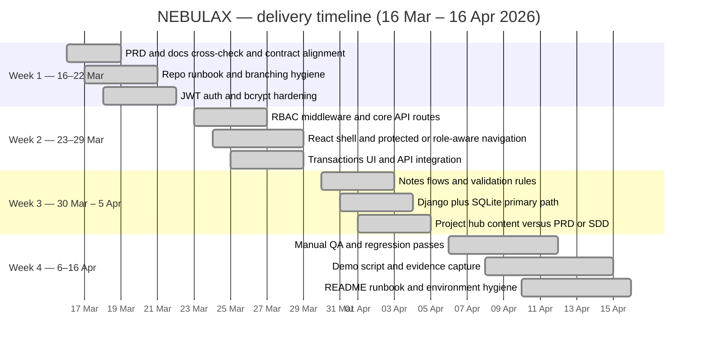

# IT6006 — NEBULAX · Project Kanban

**Purpose:** A Kanban-style record of how work flowed through the project: **who owned what**, **when it was completed**, and how it maps to **IT6006 Assessment 2** deliverables. Dates below reflect the team’s **recent delivery window** (March–April 2026) and should be **cross-checked** with **Git history**, **meeting notes**, and **submission artefacts** where evidence is required.

**Team:** NEBULAX · **Module:** IT6006 — Secure Finance Management Web Application  

**Status:** **Submission-ready** — core application, documentation, and team evidence are complete for hand-in per module instructions.

**Reporting window:** **16 March 2026 → 16 April 2026** (inclusive).

---

## 1. Alignment with IT6006 Assessment 2 (100 points)

The assessment uses **six criteria**. This board supports evidence for **team setup**, **requirements and privacy**, **URLs**, **authentication and authorisation**, and **Task 4 reflection** (see individual contribution documents in `docs/task4/`).

| Criterion | Task | Points | How NEBULAX addresses it (summary) |
|-----------|------|--------|-----------------------------------|
| Software Development Lifecycle: Team Setup and Tools Selection | Task 1 | 10 | Team contract, GitHub workflow, shared tools (React, Django, documented run paths). |
| Requirements Analysis | Task 2 | 20 | PRD: business, functional, and non-functional requirements for the finance application. |
| Privacy Policies Setup | Task 2 | 20 | PRD §8 and related docs: privacy scope, access control, retention posture, technical measures. |
| Implementation of URLs | Task 3 | 20 | SDD and Django `urls.py` / REST map: consistent `/api/...` routes per functional requirements. |
| Implementation: Authentication, Authorisation | Task 3 | 20 | JWT, bcrypt, RBAC (ADMIN / ACCOUNTANT / USER) enforced on protected routes and in the UI. |
| Reflective Journal & Personal Contribution | Task 4 | 10 | Task 4 write-ups and evaluation forms; Git/PR evidence as required by the brief. |

---

## 2. How to read this board

- **Columns:** **Backlog → To do → In progress → Review → Done**.  
- Each **card** lists a **primary owner** and a **completion date** within the reporting window.  
- The **snapshot** below reflects the **closed** state for submission: planned work is tracked through to **Done**.

---

## 3. Snapshot — submission (April 2026)

| Backlog | To do | In progress | Review | Done |
|--------|-------|---------------|--------|------|
| — | — | — | — | *All major delivery items — see §5* |

Optional follow-ups (e.g. extra API demo scripts) are **out of scope** for the core rubric if the application and docs already satisfy Assessment 2.

---

## 4. Timeline (Gantt) — delivery window

Work streams below fall within **16 Mar – 16 Apr 2026**, consistent with the **team contract** phases (setup and requirements, design and build, testing and submission) as completed in this period.

---

## 5. Cards completed (**Done**)

**Completion dates** fall within **16 Mar – 16 Apr 2026**.

### Governance and documentation

| Card | Primary owner | Done date |
|------|----------------|-----------|
| Team contract and roles aligned with delivery | All | 2026-03-19 |
| PRD and requirements cross-check | Muskan, Piyush | 2026-03-20 |
| Progress and contribution report update | Team lead | 2026-04-12 |
| Weekly meeting notes and status captured | Rotating recorder | 2026-04-14 |

### Backend, security, data

| Card | Primary owner | Done date |
|------|----------------|-----------|
| Repository structure and run instructions | Team lead | 2026-03-21 |
| JWT auth and bcrypt password storage | Team lead | 2026-03-22 |
| RBAC middleware and consistent JSON errors | Team lead | 2026-03-27 |
| Users, transactions, notes routes per SDD | Team lead | 2026-03-29 |
| Django + SQLite assessment path | Team lead | 2026-04-04 |
| Optional Node + MongoDB parallel API | Team lead | 2026-04-02 |
| Validation rules (email, amounts, roles) | Team lead | 2026-04-03 |

### Frontend and UX

| Card | Primary owner | Done date |
|------|----------------|-----------|
| React (Vite) app with protected routes | Muskan | 2026-03-26 |
| Login, dashboard, transactions UI | Muskan | 2026-03-29 |
| Credit or debit notes UI (staff) | Muskan | 2026-04-03 |
| Admin users screen | Muskan | 2026-04-05 |
| Project hub aligned with PRD or SDD | Muskan, Piyush | 2026-04-05 |
| Role-aware navigation and empty or loading states | Muskan | 2026-04-06 |

### QA and integration

| Card | Primary owner | Done date |
|------|----------------|-----------|
| Manual test passes — login and navigation | Simranjeet | 2026-04-08 |
| Role-based regression after API or UI changes | Simranjeet | 2026-04-10 |
| Smoke test before demo or submission | Simranjeet | 2026-04-14 |
| Integration fixes from UI or API review | Team lead, Muskan | 2026-04-11 |

### Design alignment and narrative

| Card | Primary owner | Done date |
|------|----------------|-----------|
| API and URL alignment with documentation | Piyush | 2026-04-04 |
| Demo narrative and doc consistency | Piyush | 2026-04-10 |
| Presentation or lecturer contribution outline | Piyush, Muskan | 2026-04-13 |

---

## 6. Week-by-week Kanban mini-boards (delivery window)

### 16–22 March 2026

| To do | In progress | Done |
|-------|---------------|------|
| — | — | PRD cross-check, repo runbook, JWT and core API hardening |

### 23–29 March 2026

| To do | In progress | Done |
|-------|---------------|------|
| — | — | RBAC routes, React and transactions integration, protected navigation |

### 30 March – 5 April 2026

| To do | In progress | Done |
|-------|---------------|------|
| — | — | Django and SQLite path, notes flows, project hub, admin users |

### 6–16 April 2026

| To do | In progress | Done |
|-------|---------------|------|
| — | — | QA and regression, smoke tests, demo script, README |

---

## 7. Evidence and integrity

- **Version control:** Link cards to **commits** and **pull requests** where the brief asks for technical evidence.  
- **Documentation:** The **PRD**, **SDD**, **team contract**, and **Task 4** submissions are the primary written sources for requirements, privacy, URLs, and auth.  
- **Meetings:** Weekly cadence is described in the team contract; keep minutes consistent with actual team practice.

---

*NEBULAX · IT6006 · Project planning record.*
